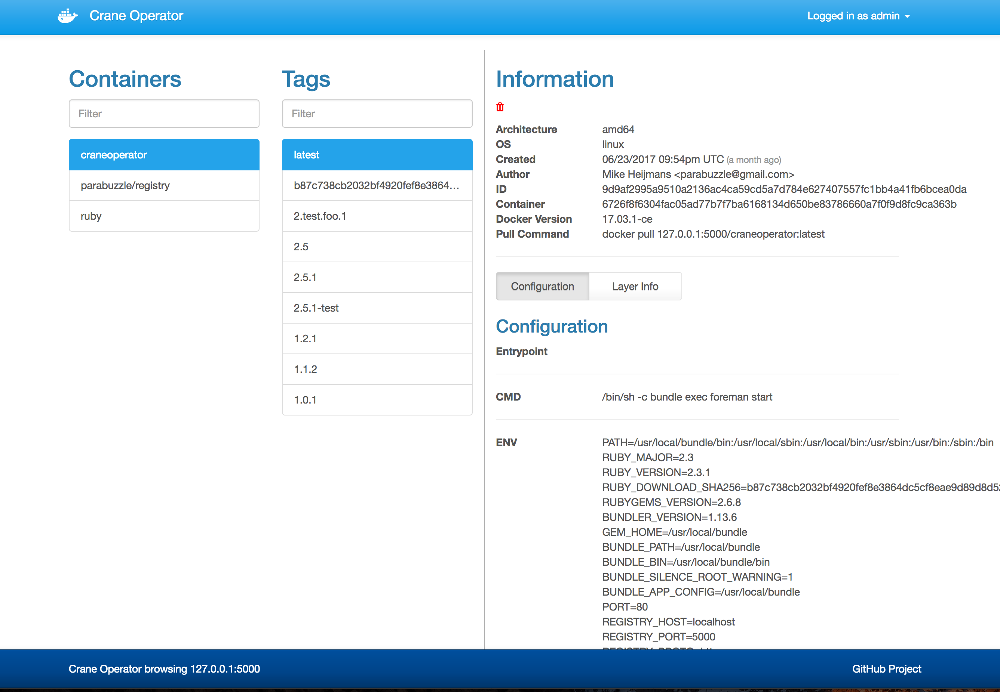

# CraneOperator
Just as crane operators can see where all the containers that are in the shipyard, CraneOp gives you a simple web interface for browsing around a Docker Registry running version 2.0+

**VERSION 2.2 Includes a bunch of new requested features!**

## What's new in Version 2.2?

   * Filtering of container list
   * Filtering of the tag list
   * More layer info
   * Permalinks!
   * Login to the registry through the UI
   * Default tag selection if there's only 1 tag for a container

[](https://circleci.com/gh/parabuzzle/craneoperator)



## Why Crane Operator?

When you run your own internal docker registry, it can be challenging to find out what has been saved there. I wanted to create a simple and lightweight frontend for browsing my registry. Most solutions that exist are built for registry v1 and don't work with the newer registry v2. (to be honest, its hard enough to even get registry v2 working... browsing it shouldn't be)

## How do I run it?

```
docker run -d -p 80:80 parabuzzle/craneoperator:latest
```

## How do I configure it?

Available Environment Variables:

*note: some variables changed in version 2.2*

  * **REGISTRY_HOST** - the registry host to browse (default: `localhost`)
  * **REGISTRY_PORT** - the port of the registry host (default: `5000`)
  * **REGISTRY_PROTOCOL** - the protocol to use (ie: `http` or `https`) (default: `https`)
  * **SSL_VERIFY** - should the certificate be verified if using SSL (default: `true`)
  * **REGISTRY_PUBLIC_URL** - optional url to use for displaying in pull command and footer (default: `REGISTRY_HOST`:`REGISTRY_PORT`)
  * **ALLOW_REGISTRY_LOGIN** - Adds a login option to the UI for logging into the Registry for each user
  * **SESSION_SECRET** - The session secret for storing the user credentials passed in via `ALLOW_REGISTRY_LOGIN`
    * note: You should set this to a long random string if you are using `ALLOW_REGISTRY_LOGIN`
  * **REGISTRY_USERNAME** - the username to use if the registry has auth enabled (if `ALLOW_REGISTRY_LOGIN` enabled, this is overridden by the user's session)
  * **REGISTRY_PASSWORD** - the password to use if the registry has auth enabled (if `ALLOW_REGISTRY_LOGIN` enabled, this is overridden by the user's session)
  * **TITLE** - Changes the brand title (for those that like to change that sort of thing)
  * **USERNAME** - setting this will activate BASIC AUTH and require this username
  * **PASSWORD** - optional password for BASIC AUTH (you must set the `USERNAME` for this to work)
  * **REGISTRY_ALLOW_DELETE** - when set to true will expose the delete action on images (default: false)
    * note: you must enable delete actions on your registry.
    * note: some caching schemes may also cause deletes to occur but not be apparent in the UI right away


```
docker run -d \
  -p 80:80 \
  -e REGISTRY_HOST=registry.yourdomain.com \
  -e REGISTRY_PORT=443 \
  -e REGISTRY_PROTOCOL=https \
  -e SSL_VERIFY=false \
  -e ALLOW_REGISTRY_LOGIN=true \
  -e REGISTRY_ALLOW_DELETE=true \
  parabuzzle/craneoperator:latest
```


