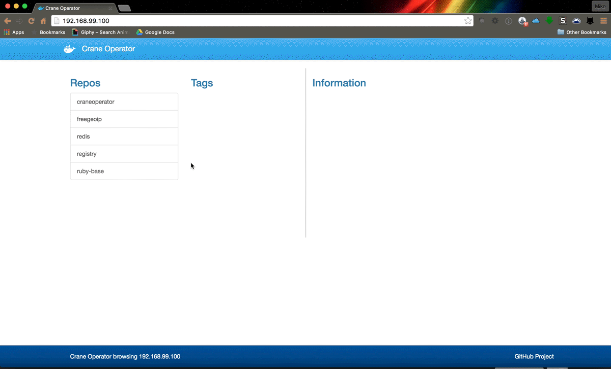
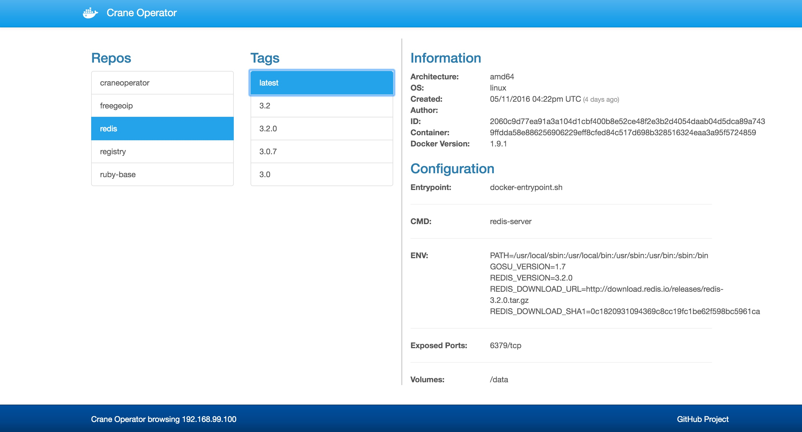

# CraneOperator
Just as crane operators can see where all the containers that are in the shipyard, CraneOp gives you a simple web interface for browsing around a Docker Registry running version 2.0+

[](https://circleci.com/gh/parabuzzle/craneoperator)



## Why Crane Operator?

When you run your own internal docker registry, it can be challenging to find out what has been saved there. I wanted to create a simple and lightweight frontend for browsing my registry. Most solutions that exist are built for registry v1 and don't work with the newer registry v2. (to be honest, its hard enough to even get registry v2 working... browsing it shouldn't be)

## How do I run it?

```
docker run -d -p 80:80 parabuzzle/craneoperator:latest
```

## How do I configure it?

Available Environment Variables:

  * **REGISTRY_HOST** - the registry host to browse (default: `localhost`)
  * **REGISTRY_PORT** - the port of the registry host (default: `5000`)
  * **REGISTRY_PROTO** - the protocol to use (ie: `http` or `https`) (default: `https`)
  * **REGISTRY_SSL_VERIFY** - should the certificate be verified if using SSL (default: `true`)
  * **USERNAME** - setting this will activate BASIC AUTH and require this username
  * **PASSWORD** - optional password for BASIC AUTH (you must set the `USERNAME` for this to work)

```
docker run -d \
  -p 80:80 \
  -e REGISTRY_HOST=registry.yourdomain.com \
  -e REGISTRY_PORT=443 \
  -e REGISTRY_PROTO=https \
  -e REGISTRY_SSL_VERIFY=false \
  -e USERNAME=admin \
  -e PASSWORD=s3cr3t \
  parabuzzle/craneoperator:latest
```


